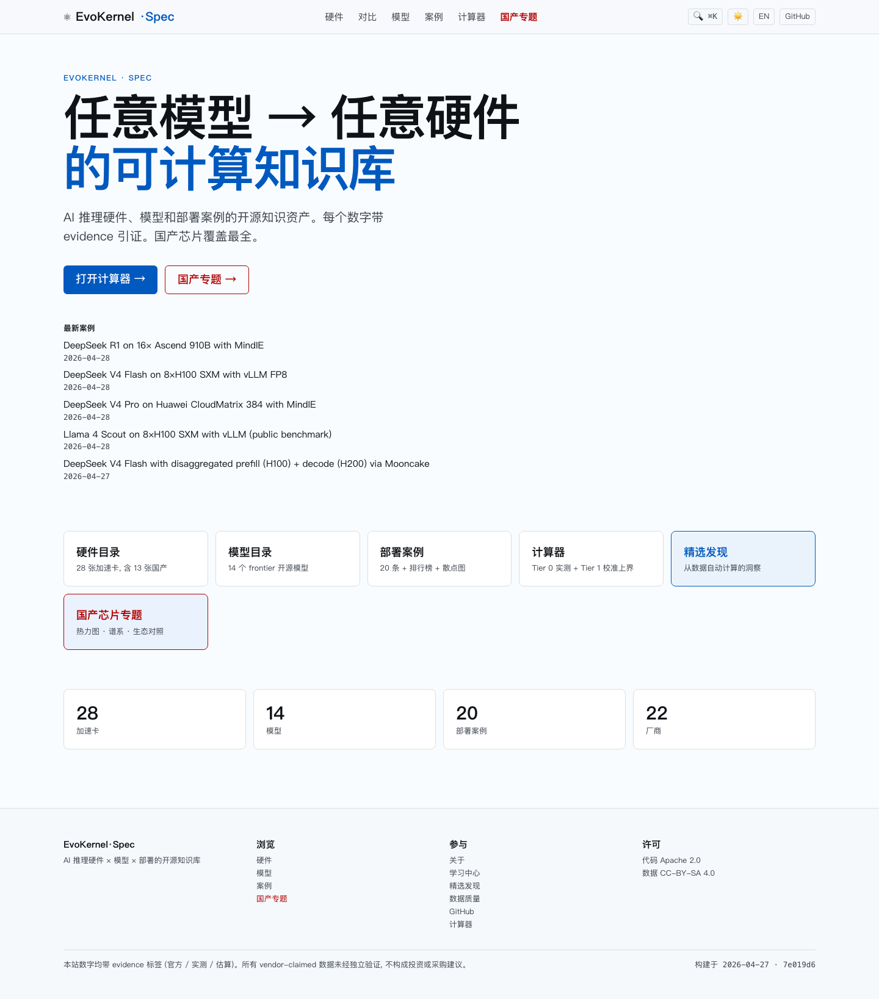
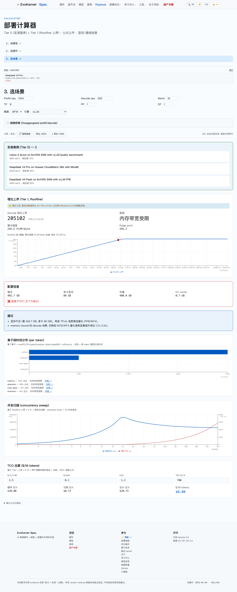
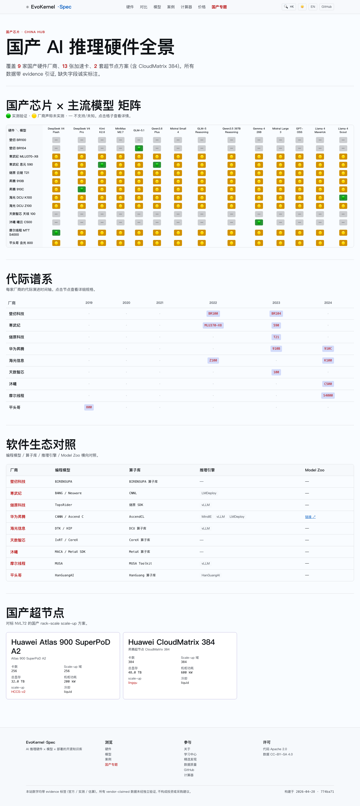
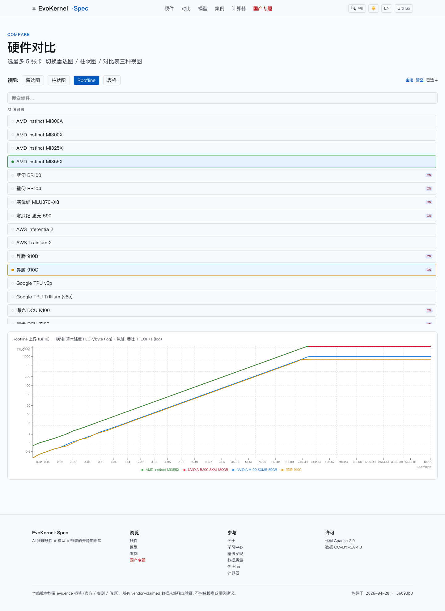
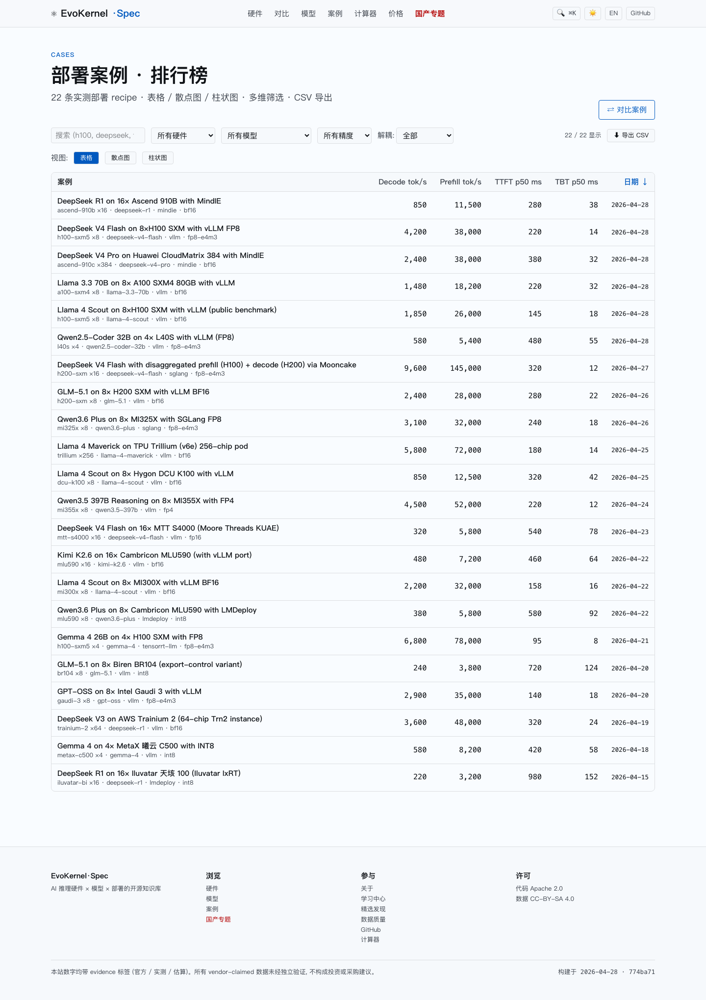
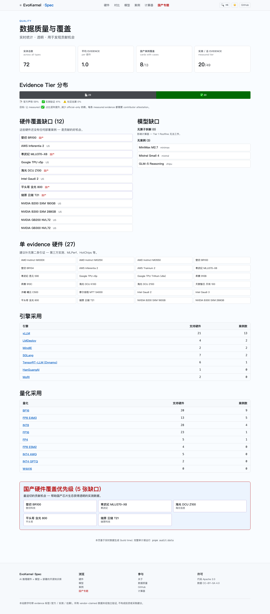

# EvoKernel Spec

> AI 推理硬件 × 模型 × 部署的开源知识库 — 国产芯片覆盖最全 / 可信度可引证 / 计算器透明

[](LICENSE)
[](DATA_LICENSE)
[](#)
[](#)
[](#)
[](https://github.com/ying-wen/evokernel-spec/releases/latest)



## Highlights

- **36 加速卡** 跨 17 家厂商: NVIDIA / AMD / Intel / AWS / Google / Cerebras / Groq / Tenstorrent + **9 家国产** (昇腾 · 寒武纪 · 海光 · 摩尔线程 · 燧原 · 壁仞 · 沐曦 · 天数智芯 · 平头哥)
- **覆盖各种形态**: 数据中心 SXM/OAM/PCIe + **wafer-scale (Cerebras WSE-3)** + **on-die SRAM (Groq LPU)** + **reconfigurable RDU (SambaNova)** + 国产超节点 (CloudMatrix 384/768)
- **17+2 frontier 模型**: 大语言 (DeepSeek V4 Pro / Kimi K2.6 / Qwen 3.6 / Llama 4 / GLM-5 etc.) + **scientific (AlphaFold 3 蛋白折叠 · GraphCast 全球天气)** + 算子 FLOP/byte 拆解
- **22 部署案例**: 含 CloudMatrix 384 超节点、disaggregated 部署、所有 9 家国产卡
- **Tier 0 实测查表 + Tier 1 透明 Roofline 计算器**: 含 per-operator breakdown / concurrency sweep / TCO ($/M tokens) / disaggregated mode
- **/pricing TCO 排行榜**: 公式公开 · 18 张卡 best/median/worst $/M tokens
- **国产芯片专题**: 矩阵热力图 + 代际谱系 + 软件生态对照
- **数据可信度三档**: 📄 官方声称 · ✅ 实测验证 · ⚠️ 社区估算
- **6 个 JSON API**: `/api/{index,hardware,models,cases,openapi}.json` + `/api/health.json`+`/api/healthz` (CC-BY-SA 4.0)
- **生产级本地部署**: `./launch.sh` 一键 build+health-poll+12 路由 smoke / `pack:dist` 离线 tar.gz + sha256 sidecar
- **WCAG 2 AA 兼容**, 中文+英文, 支持深色主题
- **完整 CI 6 jobs**: validate · type-check · unit · build · e2e (151 测试, axe a11y, Lighthouse) · deployment-smoke (launch.sh + 健康探针 + 离线 tarball artifact) · 周度 evidence 链接健康检查

## 截图

### 首页 + 计算器
| | |
|---|---|
|  |  |
| **首页** — 数据规模 + 入口 + 最新案例 | **计算器** — Tier 0 + Tier 1 + Roofline + 算子拆解 + concurrency + TCO |

### 国产专题 + 硬件对比
| | |
|---|---|
|  |  |
| **国产专题** — 矩阵热力图 + 代际谱系 + 生态对照 | **对比** — 雷达图 / 柱状图 / Roofline 叠加 / 表格 |

### 案例库 + 数据质量
| | |
|---|---|
|  |  |
| **案例排行榜** — 多维筛选 + 排序 | **数据质量** — 实时审计 + 覆盖缺口 |

## 快速上线 (Quick start)

一行命令生产级本地部署 — 自动 install · validate · build · 启动 · health-poll · 12 路由 smoke check:

```bash
git clone https://github.com/evokernel/evokernel-spec
cd evokernel-spec
./launch.sh                # 或者: pnpm launch
```

成功后控制台打印:
```
  ✓  evokernel-spec is LIVE
  URL:        http://127.0.0.1:4321/
  Health:     http://127.0.0.1:4321/api/health.json
  Build SHA:  774ba71
  Pages:      237 page(s) built
  Hardware:   31 cards loaded
```

```bash
pnpm launch:fast          # 跳过 build/validate, 用现有 dist (秒级重启)
pnpm launch:stop          # 干净关停
pnpm health               # 查看健康端点 JSON
curl http://127.0.0.1:4321/api/healthz   # K8s 风格 plain "ok" 探针
```

systemd 单元 / launchd plist 详见 [DEPLOYMENT.md](DEPLOYMENT.md#local-production-one-command-launch)。

## 本地开发

```bash
pnpm install

# Development
pnpm dev          # http://localhost:4321 (HMR)
pnpm build        # static build to apps/web/dist
pnpm preview      # serve dist locally
pnpm test:e2e     # full Playwright sweep (87 tests, ~9s)

# Data quality
pnpm validate     # zod schema + cross-references
pnpm check-links  # evidence URL reachability
pnpm audit:data   # outliers + coverage gaps

# Testing
pnpm test                                       # unit (vitest)
pnpm --filter web exec playwright test          # e2e + a11y + perf
```

## 数据 API

所有数据通过静态 JSON API 提供 (CC-BY-SA 4.0):

```bash
curl https://evokernel.dev/api/hardware.json | jq '.items[] | select(.vendor.country=="CN") | .id'
# ascend-910b, ascend-910c, mlu370-x8, mlu590, dcu-z100, dcu-k100, ...

curl https://evokernel.dev/api/openapi.json | jq '.info.version'
# "1.0.0"
```

完整 OpenAPI 3.1 规范: [`/api/openapi.json`](https://evokernel.dev/api/openapi.json)

## 文档导航 / Documentation Map

| 文件 | 内容 |
|---|---|
| [README.md](README.md) | 项目概览、快速上线、API、贡献入口（你在看的） |
| [/contribute](https://github.com/ying-wen/evokernel-spec/blob/main/apps/web/src/pages/contribute.astro) | **3 条贡献者赛道（厂商 / 社区 / 实测）+ 闭环流程** |
| [docs/DATA-TIERING.md](docs/DATA-TIERING.md) | **数据可信度三档政策、source-type → tier 矩阵、争议处理** |
| [docs/DEVELOPMENT.md](docs/DEVELOPMENT.md) | 架构图、目录结构、添加新硬件/模型/案例的流程、调试技巧 |
| [docs/V1.2-VISION.md](docs/V1.2-VISION.md) | "任意模型 × 任意硬件 编译/优化平台" 战略转向 |
| [DEPLOYMENT.md](DEPLOYMENT.md) | 本地一键部署、Cloudflare Pages、nginx、systemd、Release 工作流 |
| [CONTRIBUTING.md](CONTRIBUTING.md) | DCO 签署规范、双语贡献指南 |
| [CONTRIBUTORS.md](CONTRIBUTORS.md) | **贡献者署名榜** |
| [SECURITY.md](SECURITY.md) | 安全漏洞披露政策、tarball 校验流程 |
| [docs/KNOWN_ISSUES.md](docs/KNOWN_ISSUES.md) | 已知问题、限制、变通方案（按严重度分级） |
| [docs/ROADMAP.md](docs/ROADMAP.md) | v1.2 / v1.3 / v2.0 路线图，欢迎 PR |
| [CHANGELOG.md](CHANGELOG.md) | 版本变更日志（Keep-a-Changelog 格式） |

## 贡献

每个数字都需要 evidence 引证。详见 [CONTRIBUTING.md](CONTRIBUTING.md)。

最高优先级贡献机会:
- **数据**：[实时 /quality 数据质量页](https://evokernel.dev/quality/) 中标记的国产硬件无 case 的卡
- **代码**：[ROADMAP.md](docs/ROADMAP.md) v1.2 中 high-priority 项均欢迎 PR

## 部署

- **本地一键部署**: `./launch.sh`（见上方"快速上线"）
- **生产部署**: Cloudflare Pages / Vercel / nginx / systemd 等详见 [DEPLOYMENT.md](DEPLOYMENT.md)
- **离线分发**: `pnpm pack:dist` 生成 2.6 MB tar.gz + sha256

## 已知问题与下一步

完整列表见 [docs/KNOWN_ISSUES.md](docs/KNOWN_ISSUES.md) 和 [docs/ROADMAP.md](docs/ROADMAP.md)。当前关注:

- 🟡 `/api/health.json` SSG 限制：body 正确但 HTTP 状态码恒为 200（v1.2 规划修复）
- 🟡 23/31 张卡的 architecture 数据为 `tier: estimated`，等待 vendor 白皮书或 Tier 0 测量
- 🟡 EN 翻译滞后于 ZH（i18n fallback 防止 404，但部分页面文案仍为中文）
- 🟡 Lighthouse CI 是周度 cron，不是 PR-time gate（v1.2 计划接入）
- 🟢 Compare > 8 张卡 radar/bar 可读性下降（已有软警告，v1.2 规划 small-multiples）

## English

Open-source knowledge base for AI inference deployment across hardware (incl. 9 Chinese vendors) and frontier open-source models, with transparent Tier 0/1 calculator. Inspired by [SemiAnalysis InferenceX](https://inferencex.semianalysis.com/), differentiated by Chinese accelerator coverage + evidence-backed data + open API.

## License

- 代码 / Code: [Apache 2.0](LICENSE)
- 数据 / Data: [CC-BY-SA 4.0](DATA_LICENSE)
